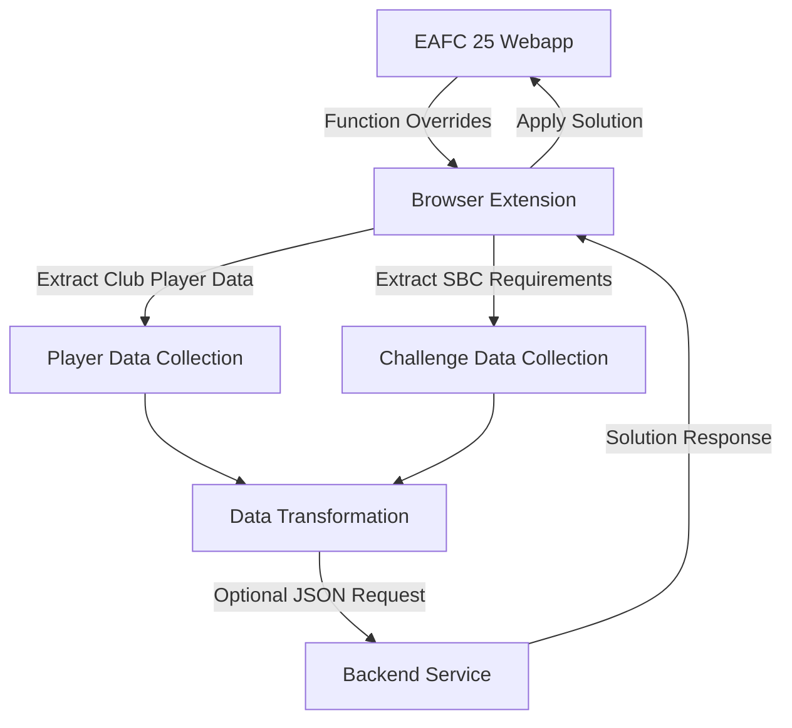

# EAFC 25 Web Application Automation: Technical Integration Guide

## Overview

This document provides a comprehensive technical guide for developers interested in creating browser-based automation solutions for the EAFC 25 Ultimate Team web application. By understanding the internal architecture and integration mechanisms, developers can create powerful extensions that enhance user experience and automate complex tasks.

## Target Application: EAFC 25 Ultimate Team Webapp

The EAFC 25 Ultimate Team web application provides a rich, interactive platform for managing virtual football teams. This guide demonstrates how to programmatically interact with the webapp's internal systems, focusing on Squad Building Challenge (SBC) optimization as a primary use case.

## Architecture

The automation solution consists of two primary components:

1. **Frontend (Browser Extension/User Script)**: JavaScript that injects into the EAFC 25 Ultimate Team webapp
2. **Backend (Optional External Service)**: A service for complex computations or data processing

### High-Level Integration Flow



## EAFC 25 Webapp Integration Mechanisms

### 1. Script Initialization

The script initializes by waiting for critical webapp services to load:

```javascript
const init = () => {
  let isAllLoaded = false;
  if (services.Localization) {
    isAllLoaded = true;
  }
  if (isAllLoaded) {
    // Initialize various overrides
    sbcViewOverride();
    playerItemOverride();
    sideBarNavOverride();
    // Additional initialization routines
  } else {
    setTimeout(init, 4000);
  }
};
init();
```

### 2. Function Overriding Techniques

The script uses prototype manipulation to extend webapp functionality:

```javascript
const homeHubOverride = async () => {
  const homeHubInit = UTHomeHubView.prototype.init;
  UTHomeHubView.prototype.init = async function () {
    // Pre-processing custom logic
    createCustomTab();
    players = await fetchPlayers();
    
    // Call original function
    homeHubInit.call(this);
    
    // Post-processing custom logic
  };
};
```

### 3. Accessing Internal Services

The EAFC 25 webapp exposes rich internal services for data access:

```javascript
// Service interaction examples
services.Club.clubDao.resetStatsCache();
services.Club.getStats();
services.SBC.requestSets().observe(this, function (obs, res) { ... });
services.Item.move(itemsToMove, destination);
services.Notification.queue([message, UINotificationType.POSITIVE]);
```

Key Services:
- `services.Club`: Player collection management
- `services.Item`: Item operations
- `services.SBC`: Squad Building Challenge interactions
- `services.Store`: Pack management
- `services.Localization`: Text localization
- `services.Chemistry`: Chemistry calculations
- `services.User`: User information
- `services.Notification`: UI notifications

### 4. Player Data Collection

Extracting player data from the user's club:

```javascript
const fetchPlayers = ({ count = Infinity, filters } = {}) => {
  return new Promise((resolve) => {
    services.Club.clubDao.resetStatsCache();
    services.Club.getStats();
    
    let result = [];
    const fetchPlayersInner = () => {
      searchClub({
        count,
        ...filters
      }).observe(undefined, async (sender, response) => {
        result = processPlayerResponse(response);
        resolve(result);
      });
    };
    fetchPlayersInner();
  });
};
```

### 5. SBC Requirements Extraction

Detailed SBC challenge requirement analysis:

```javascript
const fetchSBCData = async (sbcId, challengeId = 0) => {
  let sbcData = await sbcSets();
  let challenges = await getChallenges(sbcData[0]);
  await loadChallenge(challenges.challenges.filter((i) => i.id == challengeId)[0]);
  
  const challengeRequirements = _challenge.eligibilityRequirements.map(
    (eligibility) => ({
      scope: SBCEligibilityScope[eligibility.scope],
      count: eligibility.count,
      requirementKey: SBCEligibilityKey[keys[0]],
      eligibilityValues: eligibility.kvPairs._collection[keys[0]],
    })
  );
  
  return {
    constraints: challengeRequirements,
    formation: _challenge.squad._formation.generalPositions,
  };
};
```

## Automation Possibilities

While this guide focuses on SBC optimization, the same techniques can be applied to various EAFC 25 webapp interactions:

1. **Automated Trading**
   - Monitor market prices
   - Execute buy/sell strategies
   - Track player value trends

2. **Squad Management**
   - Automatic team chemistry optimization
   - Player fitness management
   - Contract renewal tracking

3. **Pack Opening Analysis**
   - Track pack contents
   - Calculate pack value
   - Generate statistical insights

4. **Challenge Completion**
   - Automatically solve Squad Building Challenges
   - Optimize player selection
   - Minimize coin/resource expenditure

### Example: Discovering New Interaction Points

To find additional automation opportunities:

```javascript
// Explore available services
console.log(Object.keys(services));

// Inspect prototype methods
Object.getOwnPropertyNames(UTHomeHubView.prototype)
  .filter(prop => typeof UTHomeHubView.prototype[prop] === 'function');
```

## Technical Considerations

### Security
- Respect webapp terms of service
- Avoid aggressive automation
- Implement rate limiting
- Protect user data

### Performance
- Minimize DOM manipulations
- Cache data efficiently
- Use asynchronous operations
- Implement error handling

## Conclusion

The EAFC 25 Ultimate Team webapp provides a rich environment for programmatic interaction. By understanding its internal architecture, developers can create powerful automation solutions that enhance user experience and provide unique insights.

### Next Steps for Developers
1. Explore webapp services
2. Understand object prototypes
3. Develop incremental automation
4. Respect user experience and terms of service
