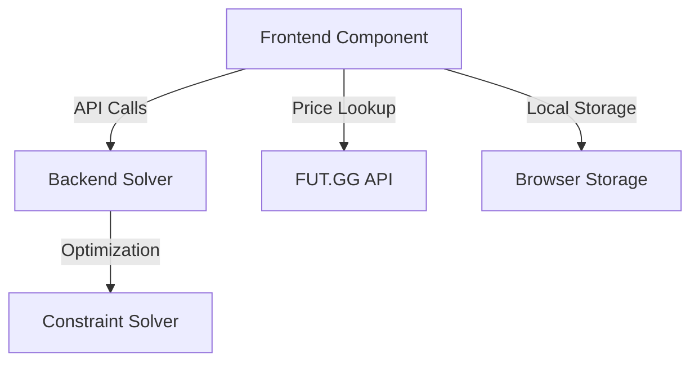
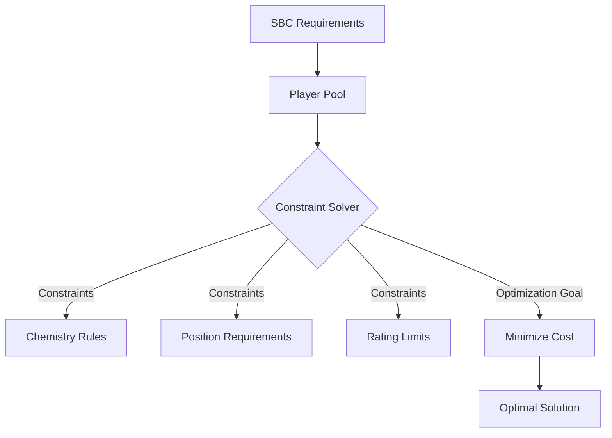

# System Architecture and Design Patterns

## Overall Architecture

### Component Structure

## Design Patterns

### 1. Prototype Manipulation
- **Location**: Frontend Integration
- **Purpose**: Override and extend existing webapp functionality
- **Key Methods**:
  - `UTHomeHubView.prototype.init`
  - `UTSBCSquadDetailPanelView.prototype.init`
  - `UTPlayerItemView.prototype.renderItem`

### 2. Dependency Injection
- **Implementation**: Service-based architecture
- **Key Services**:
  - `services.Club`
  - `services.Item`
  - `services.SBC`
  - `services.Localization`

### 3. Promise-based Asynchronous Programming
- **Technique**: Async/await for non-blocking operations
- **Examples**:
  - Player data fetching
  - Price lookups
  - SBC solution generation

### 4. Decorator Pattern
- **Usage**: Extending UI elements with additional functionality
- **Examples**:
  - Adding price displays to player cards
  - Injecting custom buttons into existing interfaces

### 5. Caching Strategy
- **Implementation**: Local storage caching
- **Cached Data**:
  - Player prices
  - User settings
  - SBC solver configurations

### 6. Strategy Pattern
- **Location**: SBC Solver Configuration
- **Purpose**: Allow dynamic configuration of solving strategies
- **Configurable Parameters**:
  - Player exclusion rules
  - Price optimization preferences
  - Auto-submission settings

## Constraint Solving Approach

### Optimization Model

### Constraint Categories
1. **Positional Constraints**
   - Required positions
   - Formation compatibility
   - Chemistry links

2. **Player Attribute Constraints**
   - Rating limits
   - League/Nation requirements
   - Rarity restrictions

3. **Cost Optimization**
   - Prioritize untradeable players
   - Minimize market value
   - Use duplicate players

## Error Handling Strategies

### 1. Graceful Degradation
- Fallback to manual selection if automated solving fails
- Provide clear error messages
- Preserve user's existing squad configuration

### 2. Retry Mechanisms
- Implement exponential backoff for API calls
- Multiple strategy attempts for SBC solving

## Performance Optimization

### 1. Batched Operations
- Limit API calls (e.g., 50 players per price lookup)
- Implement local caching to reduce external requests

### 2. Lazy Loading
- Load player data incrementally
- Cache and reuse previously fetched information

## Security Considerations

### 1. Local Processing
- All critical operations performed client-side
- No transmission of sensitive account data
- Use of isolated execution context

### 2. API Interaction
- Use of secure, read-only external APIs
- Respect rate limits
- Minimal surface for potential exploits

## Extensibility Points

1. **Price Source Plugins**
   - Easily swap or add price lookup services
   - Configurable price source priority

2. **Solver Strategy Plugins**
   - Modular constraint definition
   - Custom optimization algorithms

3. **UI Extension Framework**
   - Easily add new UI elements
   - Consistent injection mechanisms
