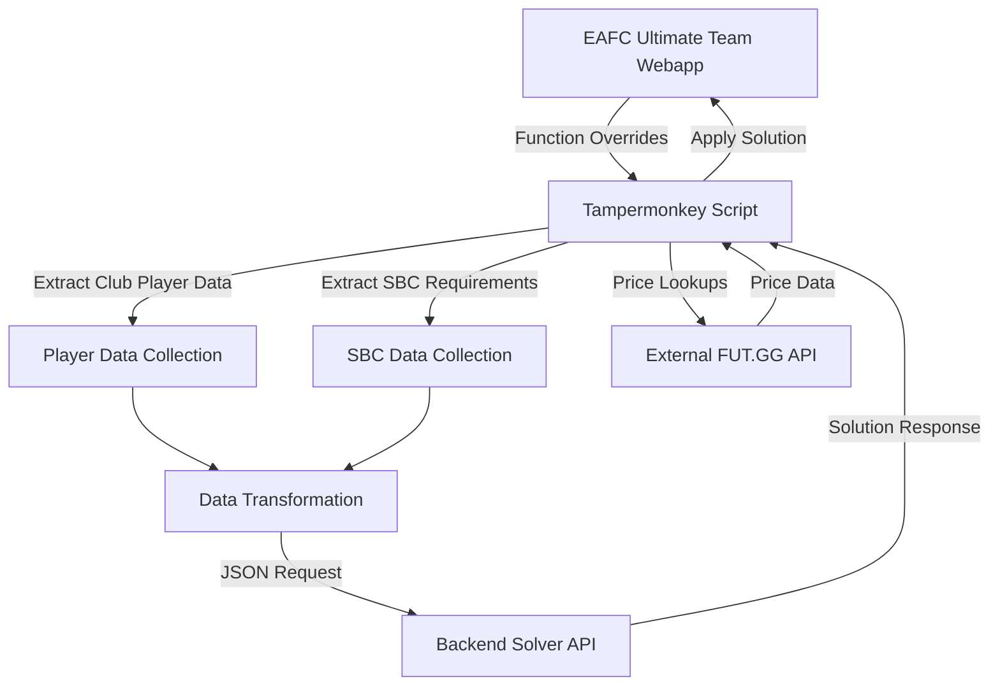

# Tampermonkey Script Integration Analysis: EAFC Ultimate Team Webapp

## Overview

This document provides a comprehensive analysis of how a Tampermonkey script can integrate with and extend the EAFC Ultimate Team webapp. The script enables automation of tasks like solving Squad Building Challenges (SBCs) by intercepting webapp functions, extracting data, and communicating with a backend solver.

## Architecture

The system consists of two main components:

1. **Frontend (Tampermonkey Script)**: JavaScript that injects into the EAFC Ultimate Team webapp to add functionality
2. **Backend (Solver)**: A service using optimization tools to solve SBCs based on specified constraints

### High-Level Integration Flow



## Integration Mechanisms

### 1. Script Initialization

The script follows a standard Tampermonkey pattern where it:

1. Declares metadata (name, version, matches, etc.)
2. Uses a self-invoking function to avoid global namespace pollution
3. Sets up CSS styles and utility functions
4. Begins by executing an initialization function that waits for the webapp to fully load

Key initialization code:
```javascript
const init = () => {
  let isAllLoaded = false;
  if (services.Localization) {
    isAllLoaded = true;
  }
  if (isAllLoaded) {
    sbcViewOverride();
    sbcButtonOverride();
    playerItemOverride();
    playerSlotOverride();
    packOverRide();
    sideBarNavOverride();
    favTagOverride();
    sbcSubmitChallengeOverride();
    unassignedItemsOverride();
    initDefaultSettings();
    futHomeOverride();
  } else {
    setTimeout(init, 4000);
  }
};
init();
```

### 2. Function Overriding

The script extensively uses prototype manipulation to override webapp functions. This is the primary method of extending the webapp's functionality:

```javascript
// Example of function override pattern
const futHomeOverride = async () => {
  const homeHubInit = UTHomeHubView.prototype.init;
  UTHomeHubView.prototype.init = async function () {
    // Pre-processing
    createSBCTab();
    players = await fetchPlayers();
    // Additional custom logic
    
    // Call original function
    homeHubInit.call(this);
    
    // Post-processing
    // Additional custom logic
  };
};
```

The script overrides functions from multiple webapp components:
- `UTHomeHubView` (main dashboard)
- `UTSBCSquadDetailPanelView` (SBC interface)
- `UTSBCSetTileView` (SBC tile display)
- `UTSlotActionPanelView` (player item actions)
- `UTSquadPitchView` (squad display)
- `UTSectionedItemListView` (item list view)
- And many others

### 3. DOM Manipulation

The script injects custom UI elements into the webapp using DOM manipulation techniques:

```javascript
// Example of creating and inserting a button
const button = createButton("idSolveSbc", "Solve SBC", async function () {
  const { _challenge } = getControllerInstance();
  solveSBC(_challenge.setId, _challenge.id);
});
insertAfter(button, this._btnExchange.__root);
```

Custom UI elements include:
- "Solve SBC" buttons
- SBC locking and price adjustment controls
- Custom navigation tabs
- Price displays on player cards
- Popup notifications

### 4. Service Interaction

The script interacts extensively with the webapp's internal services API to access data and functionality:

```javascript
// Examples of service interactions
services.Club.clubDao.resetStatsCache();
services.Club.getStats();
services.SBC.requestSets().observe(this, function (obs, res) { ... });
services.Item.move(itemsToMove, destination).observe(this, function (obs, event) { ... });
services.Notification.queue([message, UINotificationType.POSITIVE]);
```

Main services accessed:
- `services.Club` - Access to player collection
- `services.Item` - Item management (move, discard)
- `services.SBC` - SBC data and operations
- `services.Store` - Pack management
- `services.Localization` - Text localization
- `services.Chemistry` - Chemistry calculations
- `services.Configuration` - App configuration
- `services.User` - User information
- `services.Notification` - UI notifications

### 5. Local Storage

The script uses the browser's localStorage to persist settings and cache data:

```javascript
// Example of localStorage usage
localStorage.setItem(PRICE_ITEMS_KEY, JSON.stringify(cachedPriceItems));
let SolverSettings = localStorage.getItem(SOLVER_SETTINGS_KEY);
```

Key storage items:
- `futggPrices` - Cache of player price data
- `solverSettings` - User settings for the SBC solver
- `fixeditems` - Items marked as fixed (preferred for SBC solutions)
- `pivotLayouts` - Saved layouts for the club analysis tool

### 6. External API Communication

The script communicates with external services for additional functionality:

```javascript
// Communication with backend solver
let solution = await makePostRequest(apiUrl, input);

// Communication with FUT.GG price API
const futggResponse = await makeGetRequest(
  `https://www.fut.gg/api/fut/player-prices/25/?ids=${playersIdArray}`
);
```

External endpoints:
- Local backend solver API (`http://127.0.0.1:8000/solve`)
- FUT.GG price API for player valuations

## Data Flow Analysis

### 1. Player Data Collection

The script extracts player data from the user's club:

```javascript
const fetchPlayers = ({ count = Infinity, level, rarities, sort } = {}) => {
  return new Promise((resolve) => {
    services.Club.clubDao.resetStatsCache();
    services.Club.getStats();
    let offset = 0;
    const batchSize = DEFAULT_SEARCH_BATCH_SIZE;
    let result = [];
    const fetchPlayersInner = () => {
      searchClub({...}).observe(undefined, async (sender, response) => {
        // Process results
        resolve(result);
      });
    };
    fetchPlayersInner();
  });
};
```

Player data is collected from multiple sources:
- Main club inventory
- Storage items
- Concept players (optional)
- Unassigned items

### 2. SBC Data Extraction

The script extracts SBC requirements:

```javascript
const fetchSBCData = async (sbcId, challengeId = 0) => {
  // Get SBC Data
  let sbcData = await sbcSets();
  // Get challenges for the SBC
  let challenges = await getChallenges(sbcSet[0]);
  // Load specific challenge
  await loadChallenge(challenges.challenges.filter((i) => i.id == challengeId)[0]);
  
  // Extract requirements
  const challengeRequirements = _challenge.eligibilityRequirements.map(
    (eligibility, idx) => {
      // Process requirements
      return {
        scope: SBCEligibilityScope[eligibility.scope],
        count: eligibility.count,
        requirementKey: SBCEligibilityKey[keys[0]],
        eligibilityValues: eligibility.kvPairs._collection[keys[0]],
      };
    }
  );
  
  // Return structured data
  return {
    constraints: challengeRequirements,
    formation: _challenge.squad._formation.generalPositions.map(...),
    // Additional data
  };
};
```

### 3. Communication with Backend

The script sends collected data to the backend solver:

```javascript
// Prepare data for backend
const input = JSON.stringify({
  clubPlayers: backendPlayersInput,
  sbcData: sbcData,
  maxSolveTime: getSettings(sbcId, sbcData.challengeId, "maxSolveTime"),
});

// Send to backend solver
let solution = await makePostRequest(apiUrl, input);
```

The backend responds with a solution that the script applies to the webapp:

```javascript
// Process and apply solution
_squad.removeAllItems();
let _solutionSquad = [...Array(11)];
// Fill squad with solution players
JSON.parse(solution.results)
  .sort((a, b) => b.Is_Pos - a.Is_Pos)
  .forEach(function (item, index) {
    // Map solution to squad positions
  });
// Set the players in the webapp
_squad.setPlayers(_solutionSquad, true);
```

### 4. Price Data Collection

The script fetches price data from FUT.GG:

```javascript
const fetchPlayerPrices = async (players) => {
  let idsArray = players
    .filter((f) => isPriceOld(f) && f?.isPlayer())
    .map((p) => p.definitionId);

  while (idsArray.length) {
    const playersIdArray = idsArray.splice(0, 50);
    const futggResponse = await makeGetRequest(
      `https://www.fut.gg/api/fut/player-prices/25/?ids=${playersIdArray}`
    );
    // Process price data
    PriceItem(priceResponse);
  }
};
```

Price data is cached locally to reduce API calls:

```javascript
let savePriceItems = function () {
  localStorage.setItem(PRICE_ITEMS_KEY, JSON.stringify(cachedPriceItems));
};
```

## UI Extensions

### 1. SBC Solve Button

The script adds a "Solve SBC" button to the SBC interface:

```javascript
const squadDetailPanelView = UTSBCSquadDetailPanelView.prototype.init;
UTSBCSquadDetailPanelView.prototype.init = function (...args) {
  const response = squadDetailPanelView.call(this, ...args);
  const button = createButton("idSolveSbc", "Solve SBC", async function () {
    const { _challenge } = getControllerInstance();
    solveSBC(_challenge.setId, _challenge.id);
  });
  insertAfter(button, this._btnExchange.__root);
  return response;
};
```

### 2. Player Card Extensions

The script adds functionality to player cards:

```javascript
const playerItemOverride = () => {
  const UTDefaultSetItem = UTSlotActionPanelView.prototype.setItem;
  UTSlotActionPanelView.prototype.setItem = function (e, t) {
    const result = UTDefaultSetItem.call(this, e, t);
    // Add SBC Lock/Unlock button
    // Add Set Price to Zero button
    return result;
  };
  
  // Also modify player card rendering to show prices
  const UTPlayerItemView_renderItem = UTPlayerItemView.prototype.renderItem;
  UTPlayerItemView.prototype.renderItem = async function (item, t) {
    const result = UTPlayerItemView_renderItem.call(this, item, t);
    // Add price display
    // Add visual indicators for locked/fixed items
    return result;
  };
};
```

### 3. Custom Navigation Tabs

The script adds custom tabs to the webapp navigation:

```javascript
const sideBarNavOverride = () => {
  const navViewInit = UTGameTabBarController.prototype.initWithViewControllers;
  UTGameTabBarController.prototype.initWithViewControllers = function (tabs) {
    // Add SBC Solver tab
    const navBar = new UTGameFlowNavigationController();
    navBar.initWithRootController(new sbcSettingsController());
    navBar.tabBarItem = generateSbcSolveTab();
    tabs.push(navBar);
    
    // Add Club Analysis tab
    const navBar2 = new UTGameFlowNavigationController();
    navBar2.initWithRootController(new pivotTableController());
    navBar2.tabBarItem = generatePivotTab();
    tabs.push(navBar2);
    
    // Call original function with modified tabs
    navViewInit.call(this, tabs);
  };
};
```

### 4. SBC Auto-Submission

The script can automatically submit SBC solutions:

```javascript
if ((solution.status_code == autoSubmitId || autoSubmitId == 1) && autoSubmit) {
  await sbcSubmit(_challenge, sbcSet);
  if (getSettings(sbcId, sbcData.challengeId, "autoOpenPacks")) {
    // Auto-open reward packs
  }
  // Handle repeat functionality
}
```

## Security and Performance Considerations

### Security Implications

1. **Cross-Origin Requests**:
   - The script makes requests to external domains (FUT.GG)
   - Requires `@connect` permissions in the Tampermonkey metadata

2. **Local API Communication**:
   - Communicates with a locally hosted backend solver
   - Potential security risk if the backend API is accessible from external networks

3. **Data Access**:
   - The script has access to user account data (players, coins, etc.)
   - No evidence of data exfiltration beyond necessary API calls

### Performance Impact

1. **DOM Manipulation**:
   - Extensive manipulation of the webapp DOM
   - May impact rendering performance, especially with price displays on player cards

2. **API Calls**:
   - Makes additional API calls to the webapp services
   - External API calls to FUT.GG with rate limiting (50 players per request)
   - Local backend solver API calls

3. **Local Storage Usage**:
   - Caches price data to reduce API calls
   - May consume significant local storage if the user has many players

## Conclusions

The Tampermonkey script demonstrates sophisticated integration with the EAFC Ultimate Team webapp through:

1. **Extensive function overriding** to extend and modify native functionality
2. **DOM manipulation** to add custom UI elements
3. **Service interaction** to access webapp data and functionality
4. **External API communication** for price data and optimization solutions

The integration is comprehensive and touches virtually every aspect of the SBC experience in the webapp, from player management to SBC submission and pack opening.

The script showcases advanced techniques for extending webapp functionality without direct access to the source code, providing significant automation benefits to users while working within the constraints of the Tampermonkey environment.
